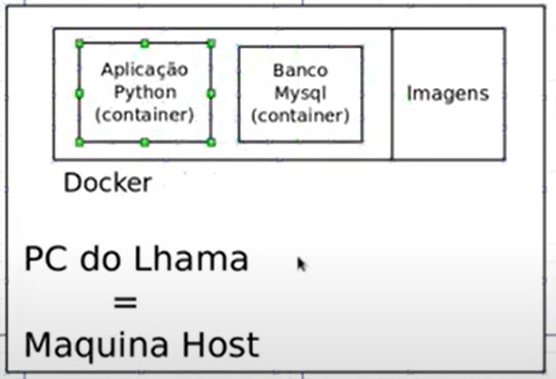

# 01: Conceitos Iniciais

- Docker permite "pegar" certas aplicações e coloca-las dentro de um ambiente.
- Esses ambientes(container) podem ficar fora do setup(configuração) da máquina.
- Container são orientados a tarefas, ele só existe para rodar a aplicação.
- Docker fornece a infraestrutura necessária para o projeto.
- Imagens: Arquivos com a configuração de cada container, cada elemento.

## Imagem



****
## comandos

```docker ps``` - lista todos os containeres rodando
``` docker exec -it python-docker_flaskapp_1 bash``` - executa o container, acessando o bash do container e "travando" o terminal do pc host

