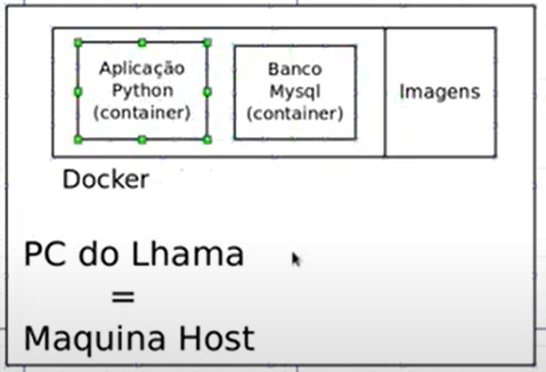

# 03: Imagem e Container da Aplicação

- Docker permite "pegar" certas aplicações e coloca-las dentro de um ambiente.
- Esses ambientes(container) podem ficar fora do setup(configuração) da máquina.
- Container são orientados a tarefas, ele só existe para rodar a aplicação.
- Docker fornece a infraestrutura necessária para o projeto.
- Imagens: Arquivos com a configuração de cada container, cada elemento.

## Imagem



## comandos

```touch .gitignore``` - cria o arquivo .gitignore

``` python3 -m venv venv``` - cria um ambiente virtual python chamado venv

```source venv/vin/activate``` - ativa o ambiente virtual python

```pip freeze > requirements.txt``` - cria um arquivo chamado requirements.txt que contém todas as dependências do projeto

```pip install -r requirements.txt``` - instala todas as dependências contidas no arquivo requirements.txt

``` export FLASK_APP=run.py``` - necessário para mostrar em qual arquivo está seu route

``` flask run``` - roda a aplicação

``` . install.sh``` - roda o script de instalação inicial

